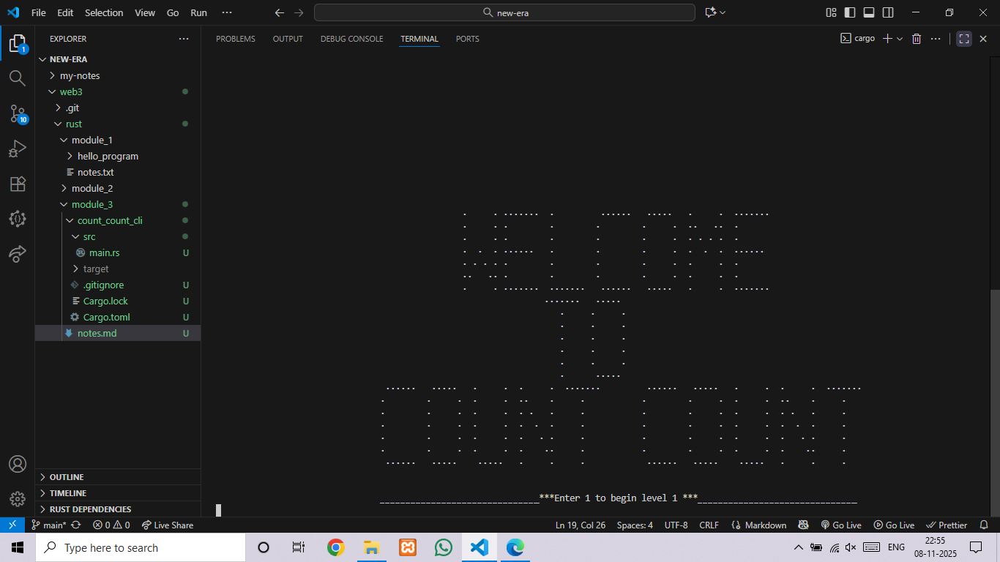

# Count Count CLI - A Memory Game Rewritten in Rust 


**`Count Count`** is a CLI-based memory and focus game. It challenges players to count a sequence of procedurally generated ASCII art shapes that flash across the screen. This project represents a significant milestone in my programming journey: a complete rewrite of one of my foundational C projects in the Rust programming language.

This endeavor was undertaken during my second week of learning Rust, serving as a practical, hands-on application of the language's core principles.

---


---

## 🎮 What is Count Count? An In-Depth Look

At its heart, `Count Count` is a test of short-term memory and observation. The game is designed to be minimalist in its interface but complex in its procedural generation, ensuring no two rounds are ever the same. The core gameplay loop is an elegant cycle of observation, recollection, and validation.

The game is structured into **Units** and **Levels**, creating a clear path of progression. Each unit introduces a new family of shapes, and the animation speed is finely tuned to increase the challenge as the player advances, demanding ever-greater levels of focus.

### Core Features

*   **🧠 Procedural Generation Engine:** This is the soul of the game. Before each level begins, a powerful generation engine makes several key decisions:
    *   **Shape Selection:** A shape is randomly chosen from the current unit's pool (e.g., a square, the letter 'K', the number '8').
    *   **Dynamic Sizing:** The size of the chosen shape is randomized within a predefined range to keep the visuals fresh.
    *   **Randomized Count:** The target number of repetitions for the player to count is randomly selected.
    *   **Variable Positioning:** To further challenge visual tracking, each shape is rendered with a random horizontal offset.

*   **📈 Progressive Difficulty Curve:** The game is designed not to be static. The core challenge is modulated by a global `Speed_Maintenance` (`S_M`) variable. This floating-point multiplier is systematically reduced at the start of each new unit, which in turn shortens the delay between shape animations, making later levels significantly faster and more demanding.

*   **🎨 Extensive ASCII Art Rendering Engine:** The visual appeal of `Count Count` comes from its massive, built-in library of over 50 dedicated rendering functions. Each function is a self-contained algorithm that uses a combination of nested loops and precise conditional logic to draw a specific shape, character, or number onto the console grid.

*   **🦀 Robust & Safe by Design (The Rust Advantage):** The entire game is built with Rust's safety-first principles. The input system is a prime example: it gracefully handles non-numeric input without crashing, and the use of Rust's `String` type completely eradicates the possibility of buffer overflow vulnerabilities that are a common concern in C.

---

## 🎨 The ASCII Art Showcase

The game features a wide variety of procedurally generated shapes. Below is a comprehensive list of all currently implemented patterns, organized by unit.

<br>

<details>
<summary><b>▶️ Unit 1: Geometric Shapes</b></summary>
<br>

| Shape Name | Rendition |
| :--- | :--- |
| **Triangle** | <pre><code>   .
  . .
 .   .
.     .</code></pre> |
| **Square** | <pre><code>.....
.....
.....
.....
.....</code></pre> |
| **Circle** | <pre><code> .-. 
/   \
\   /
 '-' </code></pre> |
| **Arrow** | <pre><code>  .
 . .
. . .
  .
  .</code></pre> |

</details>

<details>
<summary><b>▶️ Unit 2: Alphanumeric Characters (Letters)</b></summary>
<br>

| Letter | Rendition | Letter | Rendition |
| :--- | :--- | :--- | :--- |
| **A** | <pre><code> . 
. .
...
. .
. .</code></pre> | **N** | <pre><code>.  .
.. .
. ..
.  .
.  .</code></pre> |
| **B** | <pre><code>...
.  .
...
.  .
...</code></pre> | **O** | <pre><code> ... 
.   .
.   .
.   .
 ... </code></pre> |
| **C** | <pre><code> ...
.
.
.
 ...</code></pre> | **P** | <pre><code>...
.  .
...
.
.</code></pre> |
| **D** | <pre><code>..
. .
.  .
. .
..</code></pre> | **Q** | <pre><code> ... 
.   .
. . .
.  ..
 ... .</code></pre> |
| **E** | <pre><code>....
.
...
.
....</code></pre> | **R** | <pre><code>...
.  .
...
. .
.  .</code></pre> |
| **F** | <pre><code>....
.
...
.
.</code></pre> | **S** | <pre><code>....
.
 ...
    .
....</code></pre> |
| **G** | <pre><code> ...
.
. ..
.  .
 ...</code></pre> | **T** | <pre><code>.....
  .
  .
  .
  .</code></pre> |
| **H** | <pre><code>.  .
.  .
....
.  .
.  .</code></pre> | **U** | <pre><code>.   .
.   .
.   .
.   .
 ... </code></pre> |
| **I** | <pre><code>...
 .
 .
 .
...</code></pre> | **V** | <pre><code>.   .
.   .
 . .
 . .
  .</code></pre> |
| **J** | <pre><code>....
   .
   .
.  .
 ..</code></pre> | **W** | <pre><code>.   .
. . .
. . .
. . .
.   .</code></pre> |
| **K** | <pre><code>.  .
. .
..
. .
.  .</code></pre> | **X** | <pre><code>.   .
 . .
  .
 . .
.   .</code></pre> |
| **L** | <pre><code>.
.
.
.
....</code></pre> | **Y** | <pre><code>.   .
 . .
  .
  .
  .</code></pre> |
| **M** | <pre><code>.   .
.. ..
. . .
.   .
.   .</code></pre> | **Z** | <pre><code>.....
   .
  .
 .
.....</code></pre> |

</details>

<details>
<summary><b>▶️ Unit 2: Alphanumeric Characters (Numbers)</b></summary>
<br>

| Number | Rendition | Number | Rendition |
| :--- | :--- | :--- | :--- |
| **0** | <pre><code> ... 
.   .
.   .
.   .
 ... </code></pre> | **5** | <pre><code>....
.
....
   .
....</code></pre> |
| **1** | <pre><code> .
..
 .
 .
...</code></pre> | **6** | <pre><code> ...
.
....
.   .
 ... </code></pre> |
| **2** | <pre><code>....
   .
....
.
....</code></pre> | **7** | <pre><code>....
   .
  .
 .
 .</code></pre> |
| **3** | <pre><code>....
   .
....
   .
....</code></pre> | **8** | <pre><code> ... 
.   .
 ... 
.   .
 ... </code></pre> |
| **4** | <pre><code>.  .
.  .
....
   .
   .</code></pre> | **9** | <pre><code> ... 
.   .
 ....
    .
 ... </code></pre> |

</details>

---

## 🔬 Architectural Deep Dive: How It Works

The game's logic is a carefully orchestrated collaboration between several distinct components, all working together to create a seamless gameplay experience.

#### 1. The Main Game Loop (`main` function)
This function serves as the high-level conductor of the entire application. Its responsibilities include:
*   **Initialization:** Displaying the ASCII art welcome screen and setting up initial game state variables like `level` and `unit`.
*   **Player Intent:** Waiting for the player to start the game, with input validation to ensure a smooth start.
*   **Progression Management:** It contains the nested `while` loops that control the flow from one level to the next, and from one unit to the next.
*   **Speed Control:** Critically, before starting a new level, it consults the current `unit` to set the base animation speed (`S_M`), ensuring the difficulty progresses as intended.
*   **Calling the Core Logic:** It invokes the `print_shape` function to run the actual level animation.
*   **Validation & Feedback:** After the animation, it captures and safely parses the player's input, compares it to the correct count, and provides immediate feedback, branching to the next level or the "play again" screen.

#### 2. The Animation Core (`print_shape` function)
If `main` is the conductor, `print_shape` is the director of each scene. For any given level, it is responsible for:
*   **Procedural Setup:** It calls the `r_b` (random between) utility to decide the shape to be shown, its size, and the correct `COUNT`.
*   **Rendering Delegation:** It uses a `match` statement to determine which specific `print_*` function to call from the rendering engine.
*   **The Animation Loop:** It executes a `for` loop that runs `COUNT` times. In each iteration, it calls the chosen rendering function and then the `speed_controller` to create the timed, flashing effect that is central to the gameplay.

#### 3. The ASCII Rendering Engine (The `print_*` Functions)
This is a modular library of over 50 individual functions, each an expert at drawing one thing.
*   **Algorithmic Drawing:** Each function implements a unique algorithm using nested loops (`for` or `while`) over a conceptual grid of rows and columns.
*   **Conditional Pixel Placement:** Inside the loops, `if/else` statements form the "logic brush." These conditions determine whether to print a `.` character or a space (` `) at each coordinate of the grid, thereby forming the shape.
*   **Scalability:** The functions are designed to be scalable, taking a size parameter `n` that dynamically adjusts the dimensions of the loops and the conditional logic to draw larger or smaller versions of the same shape.

#### 4. Utility & State Management
A set of small, focused components supports the main logic:
*   **`r_b`:** A simple utility that provides a random integer within a given range, used everywhere from shape selection to sizing.
*   **`speed_controller`:** A function that abstracts the timing logic. It takes a speed multiplier and calls `thread::sleep`, providing a consistent delay across all hardware.
*   **`static mut` Variables:** To directly mirror the architecture of the original C program, global static variables (`COUNT`, `CHOICE`, `S_M`) are used to hold the game's state. Access to these is wrapped in `unsafe` blocks, a conscious design choice for this port that highlights an area for future refactoring to more idiomatic Rust patterns.

---

## 📖 Project Genesis: A Journey Across Languages

This project has a personal history that tracks my growth as a developer.

*   **The Python Prototype (2020):** The first version was a simple, ~200-line Python script I wrote in high school (11th grade). It was my initial exploration into procedural generation and game loops.

*   **The C Implementation (2022):** During my first semester at university, I undertook a much more ambitious version in C. This expanded the concept into a 1500-line program featuring a robust ASCII art engine capable of rendering the entire alphabet, numbers, and a variety of geometric shapes. You can view the original C source code [here](https://github.com/saheb-ul-lah/Count-Count-CLI).

*   **The Rust Rewrite (2025):** As I began learning Rust, I decided the best way to solidify my understanding was to tackle a familiar problem. Rewriting this game was the perfect challenge. It forced me to confront Rust's unique approach to safety, memory management, and control flow, providing an invaluable, week-long deep dive into the language.

---

## 🚀 My Rust Learning Journey: Key Concepts Explored

Rewriting this game in one week was an intense and rewarding experience. It moved me beyond basic syntax and forced me to engage with the concepts that make Rust so powerful. Here are the key topics I covered:

#### 1. **Safety & Memory Management:**
*   **The Ownership Model:** I learned to think about data ownership, moving from C's manual memory management (`malloc`/`free`) to Rust's compile-time guarantees, eliminating entire classes of bugs like use-after-free.
*   **Mutability and Borrowing (`&mut`):** The concept of immutable-by-default variables and the explicit `mut` keyword was a paradigm shift. I applied this extensively in loop counters and in safely passing data to functions, like lending a mutable reference of the input `String` to `io::stdin().read_line()`.

#### 2. **Robust Error Handling:**
*   **The `Result` Enum:** This was my biggest takeaway. In C, handling invalid `scanf` input is cumbersome and often ignored. In Rust, functions like `.parse()` return a `Result`, forcing me to handle both the `Ok(value)` and `Err(error)` cases. I used methods like `.unwrap_or()` to provide a default value for invalid input, making the program resilient and crash-proof.

#### 3. **Modern Tooling & Ecosystem:**
*   **Cargo:** Using Cargo was a breath of fresh air. Managing dependencies (like the `rand` crate for random number generation), building, and running the project with simple commands (`cargo run`) streamlined the entire development process.
*   **Crates:** I integrated an external library (`rand`) for the first time, appreciating how easily the ecosystem extends the language's core functionality.

#### 4. **Advanced Control Flow:**
*   **The `match` Statement:** I replaced complex `switch` statements from C with Rust's powerful `match` keyword. Its requirement for exhaustive pattern matching ensured I handled every possible case, preventing logic errors.

#### 5. **Input/Output (I/O):**
*   **Safe I/O Operations:** I learned the multi-step, safe way to handle user input: reading into a growable `String` (preventing buffer overflows), trimming whitespace, and then safely parsing it into the required data type.

#### 6. **`unsafe` Rust:**
*   **Bridging the Gap:** To maintain a structure similar to the C original, I used `static mut` variables. This required me to learn about and use `unsafe` blocks, teaching me where Rust draws the line and gives the programmer explicit control at the cost of compile-time guarantees. A future goal is to refactor this to a safer, more idiomatic pattern.

---

## 🛠️ Tech Stack & Tools

*   **Language:** [**Rust**](https://www.rust-lang.org/)
*   **Build System & Package Manager:** [**Cargo**](https://doc.rust-lang.org/cargo/)
*   **Core Crates:** `rand` (for procedural generation)

---

## ⚙️ Getting Started

### Prerequisites

*   **Rust Toolchain:** Install via [rustup](https://rustup.rs/).
*   **Git:** Required to clone the repository.
*   **(Windows Only)**: Requires the **Microsoft C++ Build Tools**. Install via [Visual Studio Build Tools](https://visualstudio.microsoft.com/visual-cpp-build-tools/), select "Desktop development with C++", and run `rustup default stable-msvc`.

### Installation & Running

1.  **Clone the repository:**
    ```bash
    git clone https://github.com/saheb-ul-lah/web3/tree/main/rust/module_3/count_count_cli.git
    ```

2.  **Navigate to the project directory:**
    ```bash
    cd count_count_cli
    ```

3.  **Build and run the game with Cargo:**
    ```bash
    cargo run
    ```
---

## 🔮 Future Development

As part of my continued learning, I plan to enhance this project further:

*   [ ] **Refactor `unsafe` Code:** Replace global `static mut` variables with a more idiomatic Rust state management pattern (e.g., passing a `GameState` struct).
*   [ ] **Expand Game Content:** Implement more units with increasingly complex ASCII art.
*   [ ] **High Score Persistence:** Add functionality to save and load high scores from a local file.

---